# 🔒 Awesome Secure Hybrid Data Tunnel

  
  
  
  
  

  

## 🚀 Overview & Ecosystem Summary

Welcome to the ultimate curated directory of **Secure Hybrid Data Tunnels**, **Zero-Trust Network Access (ZTNA)** solutions, **Private Interconnects**, and **Self-Hosted Mesh VPN Overlays**. 

Connecting hybrid multi-cloud infrastructure, on-premises data centers, edge nodes, and local development environments to remote clients requires modern, identity-aware, least-privilege networking. This repository indexes both top commercial enterprise platforms and high-star open-source GitHub tools.

---

## 📌 Table of Contents

- [💡 Market Overview & Sector Analysis](#-market-overview--sector-analysis)
- [🏢 SaaS & Managed Enterprise Platforms](#-saas--managed-enterprise-platforms)
- [⚡ Open-Source GitHub Projects](#-open-source-github-projects)
- [🛡️ Comparison Framework](#️-comparison-framework)
- [🤝 How to Contribute](#-how-to-contribute)
- [⚠️ Disclaimer](#️-disclaimer)
- [⭐ Star History](#-star-history)

---

## 💡 Market Overview & Sector Analysis

**Estimated Market Size**: The global **Secure Hybrid Data Tunnel & Zero-Trust Network Access (ZTNA)** market is estimated at **$7.2 Billion (2026)** and is projected to reach **$18.4 Billion by 2030** (~19.5% CAGR).

**Market Dynamics**: The sector is **moderately fragmented**. Hyperscale cloud providers (*Microsoft Azure, Google Cloud, AWS*) dominate high-bandwidth physical infrastructure and private fiber interconnects. Concurrently, specialized Zero-Trust overlay vendors (*Tailscale, Cloudflare, ngrok, NetBird*) capture rapidly expanding application-level edge tunneling, mesh VPNs, and identity-aware proxying.

---

## 🏢 SaaS & Managed Enterprise Platforms

> Listed and sorted by **Company Size / Market Capitalization / Valuation (Descending)**.

| 🏢 Platform / Provider | 💼 Company Size &amp; Valuation | 💵 Starting Tier Pricing | 🎁 Free Tier &amp; Trial Limits | 🎯 Primary Use Case |
| :--- | :--- | :--- | :--- | :--- |
| **[Azure ExpressRoute](https://azure.microsoft.com/en-us/products/expressroute/)** | **~$3.1 Trillion** (Market Cap - MSFT) | **$55.00/month** (50 Mbps Local circuit + $0.025/GB egress) | **30-Day Free Trial** ($200 Azure credits + 12 mo free services) | Enterprise private fiber circuit directly into Microsoft Azure cloud |
| **[Google Cloud Interconnect](https://cloud.google.com/interconnect)** | **~$2.1 Trillion** (Market Cap - GOOGL) | **$0.05/hour (~$36.50/mo)** (50 Mbps Partner attachment + egress) | **90-Day Free Trial** ($300 GCP free credits for new accounts) | High-availability dedicated & partner interconnects for Google Cloud |
| **[AWS Direct Connect](https://aws.amazon.com/directconnect/)** | **~$1.9 Trillion** (Market Cap - AMZN) | **$0.03/hour (~$21.60/mo)** (1 Gbps port + $0.02/GB egress) | **12-Month Free Tier** (10 GB Data Transfer Out free per month) | Low-latency private network connection bypassing public internet to AWS |
| **[Salesforce Private Connect](https://www.salesforce.com/)** | **~$280 Billion** (Market Cap - CRM) | **$2,000.00/month** (per Private Connect add-on connection) | **30-Day Free Trial** (via Salesforce Developer Edition sandbox) | Secure bidirectional AWS VPC tunnel for Salesforce Hyperforce data |
| **[Cloudflare Tunnel](https://www.cloudflare.com/products/tunnel/)** | **~$28 Billion** (Market Cap - NET) | **$7.00/user/month** (Zero Trust Standard plan for org features) | **Free Forever Plan** (Unlimited tunnels & up to 50 Zero Trust users) | Exposing web services & private networks without open inbound ports |
| **[Tailscale](https://tailscale.com/)** | **$1.0 Billion** (Series B Valuation) | **$6.00/user/month** (Starter tier, billed annually) | **Free Forever Plan** (3 users, 100 devices & 3 subnet routers) | Zero-config mesh VPN overlay powered by WireGuard, SSO & MagicDNS |
| **[ngrok Enterprise](https://ngrok.com/)** | **~$350 Million** (Series A Valuation) | **$8.00/month** (Personal tier with 1 agent & 3 reserved domains) | **Free Forever Plan** (1 agent, 1 user, 1 static domain & 1 GB/mo bandwidth) | Developer reverse tunnels to localhost with auth, TLS & webhooks |
| **[StrongDM](https://www.strongdm.com/)** | **~$300 Million** (Series B Valuation) | **$70.00/user/month** (Enterprise infrastructure access plan) | **14-Day Free Trial** (Full feature access for unlimited nodes) | Zero-trust access proxy for databases, servers, K8s & web apps |
| **[OpenVPN Cloud (CloudConnexa)](https://openvpn.net/cloud-vpn/)** | **~$200 Million** (Est. Enterprise Value) | **$7.00/connection/mo** (Standard tier billed annually at $75/yr) | **Free Forever Plan** (3 concurrent connections & 1 network region) | Cloud-managed virtual network with Zero Trust Application Access (ZTAA) |
| **[ZeroTier](https://www.zerotier.com/)** | **~$75 Million** (Series A Valuation) | **$5.00/month** (Professional tier including 25 admin seats) | **Free Forever Plan** (1 admin user & up to 25 connected devices) | Software-defined virtual Ethernet switch across multi-cloud & edge |

---

## ⚡ Open-Source GitHub Projects

> Listed and sorted by **GitHub Star Count (Descending)**. Star badges link directly to each project's stargazers page.

| 📦 Repository &amp; Star Count | 📜 License | 🛠️ Technology Stack | 📝 Key Description &amp; Focus |
| :--- | :--- | :--- | :--- |
| **[frp](https://github.com/fatedier/frp)**  | `Apache-2.0` | Go | High-performance reverse proxy for exposing local servers behind NAT/firewall to the internet. |
| **[Headscale](https://github.com/juanfont/headscale)**  | `BSD-3-Clause` | Go | Open-source, self-hosted implementation of the Tailscale coordination server. |
| **[NetBird](https://github.com/netbirdio/netbird)**  | `BSD-3-Clause` | Go / WireGuard | Zero-trust peer-to-peer overlay network platform with IDP integration & self-hosted admin UI. |
| **[Pangolin](https://github.com/fosrl/pangolin)**  | `AGPL-3.0` | Go / WireGuard / Traefik | Identity-aware reverse proxy & zero-trust tunneling platform with SSO & CrowdSec support. |
| **[localtunnel](https://github.com/localtunnel/localtunnel)**  | `MIT` | Node.js | Expose local development server ports to public URLs without firewall configuration. |
| **[Teleport](https://github.com/gravitational/teleport)**  | `AGPL-3.0` | Go | Identity-aware access proxy providing zero-trust access to SSH, Kubernetes, databases & web apps. |
| **[Nebula](https://github.com/slackhq/nebula)**  | `MIT` | Go | Scalable, fast, and secure mesh overlay networking tool originally created by Slack. |
| **[Chisel](https://github.com/jpillora/chisel)**  | `MIT` | Go / SSH | Fast TCP/UDP tunnel over HTTP secured via SSH encryption. |
| **[cloudflared](https://github.com/cloudflare/cloudflared)**  | `Apache-2.0` | Go | Official Cloudflare Tunnel client connecting origin servers to Cloudflare edge network. |
| **[Gluetun](https://github.com/qdm12/gluetun)**  | `MIT` | Go / Docker | Lightweight VPN client container supporting WireGuard & OpenVPN with DNS-over-TLS. |
| **[rathole](https://github.com/rapiz1/rathole)**  | `Apache-2.0` | Rust | Lightweight, high-performance reverse proxy in Rust for NAT traversal; alternative to frp & ngrok. |
| **[Netmaker](https://github.com/gravitl/netmaker)**  | `SSPL / Apache-2.0` | Go / Kernel WireGuard | Fast, kernel-level WireGuard overlay networks for multi-cloud & hybrid cloud topologies. |
| **[bore](https://github.com/ekzhang/bore)**  | `MIT` | Rust | Simple and efficient CLI tool in Rust for tunneling local ports to public endpoints. |
| **[Pomerium](https://github.com/pomerium/pomerium)**  | `Apache-2.0` | Go | Identity & context-aware reverse proxy implementing BeyondCorp access control model. |
| **[sish](https://github.com/antoniomika/sish)**  | `MIT` | Go | Open-source ngrok alternative supporting HTTP/WS/TCP tunnels purely via standard SSH. |
| **[WireGuard](https://github.com/WireGuard/wireguard-go)**  | `MIT` | Go / C | Foundational, high-performance VPN protocol underlying modern mesh overlay networks. |
| **[OpenZiti](https://github.com/openziti/ziti)**  | `Apache-2.0` | Go | Full-featured programmable zero-trust networking platform with application-embedded SDKs. |
| **[tinc](https://github.com/gsliepen/tinc)**  | `GPL-2.0` | C | Peer-to-peer VPN daemon using encryption and compression to create mesh networks. |
| **[wg-access-server](https://github.com/freifunkMUC/wg-access-server)**  | `MIT` | Go | All-in-one WireGuard VPN server with Web UI & OIDC single sign-on support. |

---

## 🛡️ Comparison Framework

When choosing between **Commercial Cloud Interconnects**, **Managed Zero-Trust SaaS Tunnels**, and **Self-Hosted Open-Source Mesh Networks**, evaluate your architecture against these dimensions:

1. **Network Layer**: Layer 3 (IP/WireGuard overlay) vs Layer 4 (TCP/UDP proxying) vs Layer 7 (HTTP/Identity reverse proxying).
2. **Identity Integration**: Direct OIDC / SAML / SSO provider binding vs static SSH keys vs pre-shared secrets.
3. **Data Plane Control**: Vendor-managed coordination server vs completely air-gapped self-hosted control plane (*e.g., Headscale, NetBird*).
4. **Performance & Overhead**: Kernel-space WireGuard processing vs user-space proxy routing.

---

## 🤝 How to Contribute

1. Fork this repository.
2. Add your tool to `README.md` in the appropriate table (**SaaS** or **Open-Source**).
3. Ensure exact starting tier pricing, free tier limits, licensing, and star counts are included.
4. Open a Pull Request with a short summary of the addition.

---

## ⚠️ Disclaimer

- This repository is a **community-curated directory** provided for educational and architectural reference.
- Secure tunneling tools handle mission-critical network traffic; always perform independent security audits and licensing compliance checks.

---

## ⭐ Star History

